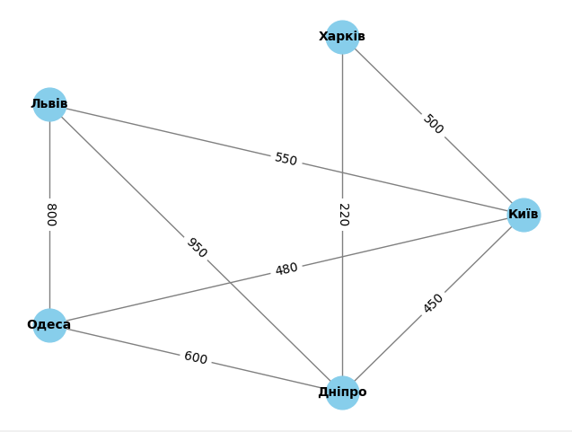

**Результати виконання алгоритмів DFS та BFS для знаходження шляхів з Києва до Одеси вказують на різні шляхи та порядок їх виводу.**

**DFS шляхи з Києва до Одеси:**
1. Київ -> Львів -> Одеса
2. Київ -> Львів -> Дніпро -> Одеса
3. Київ -> Одеса
4. Київ -> Харків -> Дніпро -> Львів -> Одеса
5. Київ -> Харків -> Дніпро -> Одеса
6. Київ -> Дніпро -> Львів -> Одеса
7. Київ -> Дніпро -> Одеса

**BFS шляхи з Києва до Одеси:**
1. Київ -> Одеса
2. Київ -> Львів -> Одеса
3. Київ -> Дніпро -> Одеса
4. Київ -> Львів -> Дніпро -> Одеса
5. Київ -> Харків -> Дніпро -> Одеса
6. Київ -> Дніпро -> Львів -> Одеса
7. Київ -> Харків -> Дніпро -> Львів -> Одеса

**Пояснення:**

- DFS (Depth-First Search) та BFS (Breadth-First Search) - це різні алгоритми обходу графа.
- DFS вибирає один із можливих шляхів та досягає кінцевої точки, перш ніж рухатися далі. Результат може залежати від порядку обходу вершин та ребер.
- BFS вибирає найкоротший шлях, рухаючись від початку графа до кінця. В результаті отримуємо коротші шляхи, але порядок може відрізнятися в залежності від того, як відвідується кожен рівень графа.

Таким чином, різниця у виведенні шляхів може бути пояснена вибором алгоритмів та їхнім підходом до обходу та знаходження шляхів у графі.